## About

I'm a high school student in Taipei (Taipei Municipal Da-An Vocational High School).
I like writing code, playing percussion, and watching anime.
Most of what I learn ends up on [hawks.tw](https://hawks.tw/), a small personal site with notes, event write-ups, and a library of things I love.

- 🧠 Machine learning, LLM evaluation, and a bit of HPC
- 🔐 CyberSec: CTFs, AIS3, HITCON
- 🖥️ Terminal tools and small self-hosted things
- 🥁 Percussion in a wind band

## Now

- 🏆 HiPAC 2026 performance-optimisation contest: award + NVIDIA special recognition → [write-up](https://hawks.tw/blog/hipac/)
- 🧪 AIS3 summer program: building an LLM cybersecurity evaluation harness
- ✍️ Using Discord as a writing tool (see `discord-ink`)

## Projects

| Project | What it is |
| --- | --- |
| [slurmtop](https://github.com/Sean-Hawks/slurmtop) | One-screen terminal dashboard for small GPU clusters: CPU, RAM, per-GPU utilisation and the Slurm queue. Single file, no dependencies. |
| [ais3-llm-seceval](https://github.com/Sean-Hawks/ais3-llm-seceval) | LLM cybersecurity capability evaluation harness built on Inspect AI and CTF benchmarks. |
| [urtube.observe.tw](https://github.com/skyhong2002/urtube.observe.tw) | Data-driven friend-finding site that matches people by real YouTube watch history. Contributor: profiles, handles, UI. |
| [personal-library-site-template](https://github.com/Sean-Hawks/personal-library-site-template) | Markdown-first template for a personal library site: reviews, activity logs, projects, search, RSS. |
| [discord-ink](https://github.com/Sean-Hawks/discord-ink) | Write in Discord, publish Markdown to GitHub. Self-hosted, optional Gemini assist. |
| [hawks-site](https://github.com/Sean-Hawks/hawks-site) | The site itself. Next.js + Markdown, deployed to GitHub Pages. |

## Latest from hawks.tw

<!-- Everything below is auto-generated from https://hawks.tw/rss.xml by .github/workflows/blog-posts.yml -->

<!-- BLOG:START -->
<table>
<tr><td width="50%" valign="top"> 2026-08-04 <b><a href="https://hawks.tw/blog/hipac/">初體驗 HiPAC！佳作、NVIDIA 特別獎、未來之星獎歷程</a></b></td><td width="50%" valign="top"> 2026-07-31 <b><a href="https://hawks.tw/blog/ais3/">什麼是 AIS3？第一次參加就上手！</a></b></td></tr>
<tr><td width="50%" valign="top"> 2026-06-18 <b><a href="https://hawks.tw/blog/machine-learning-2021/">高中生如何學 Machine Learning？以李宏毅教授的 ML 2021 學起</a></b></td><td width="50%" valign="top"> 2025-12-29 <b><a href="https://hawks.tw/blog/first-web/">關於這個 Blog</a></b></td></tr>
</table>
<!-- BLOG:END -->

More on [hawks.tw/blog](https://hawks.tw/blog/) · [Timeline](https://hawks.tw/timeline/)

## Toolbox

## Activity

<!-- Generated inside this repo by .github/workflows/graphs.yml. No third-party image service. -->

  

